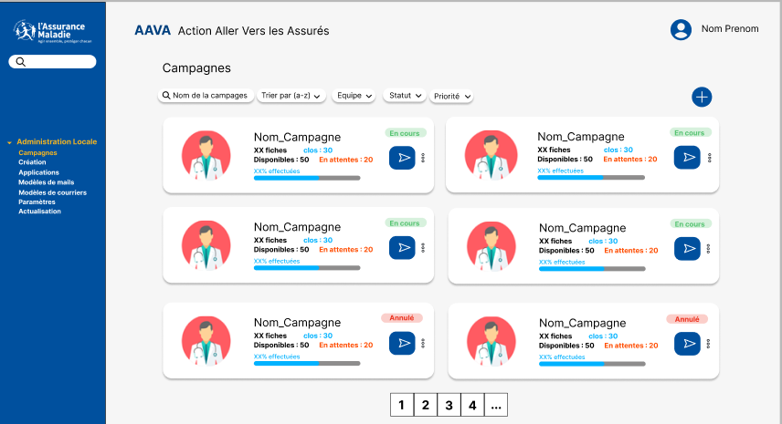

   

## AAVA

Conception & développement d’un site en Symfony, ayant pour objectif d’aider le suivi et l’accompagnement d'environ 800 000 bénéficiaires dans le cadre des campagnes d’aides de la Mission Accompagnement Santé (MISAS) ciblant les assurés en situation de vulnérabilité (ALD, femmes enceintes, personnes âgées...). Je suis intervenu sur toute la partie Fullstack et ai mis en place une démarche DevOps

## Lien(s)

- Code appartenant a la CPAM du Val-de-Marne 😵