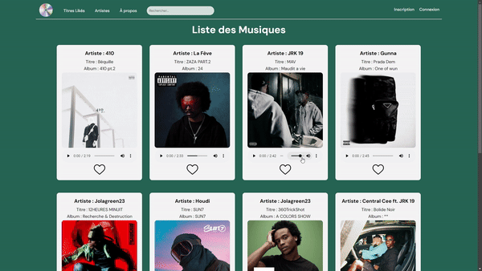

  

## Audiora

Audiora est une plateforme developpée par @MathieuAudibert & @ismaa2k de streaming musical lors d'un projet de validation de renforcement php.

- Inscription/Connexion 
- Rechercher un titre 
- Ecouter un titre 
- Liker un titre 
- Avoir sa propre playlist 

## Lien(s)

- [Github](https://github.com/MathieuAudibert/PHP-Renforcement)