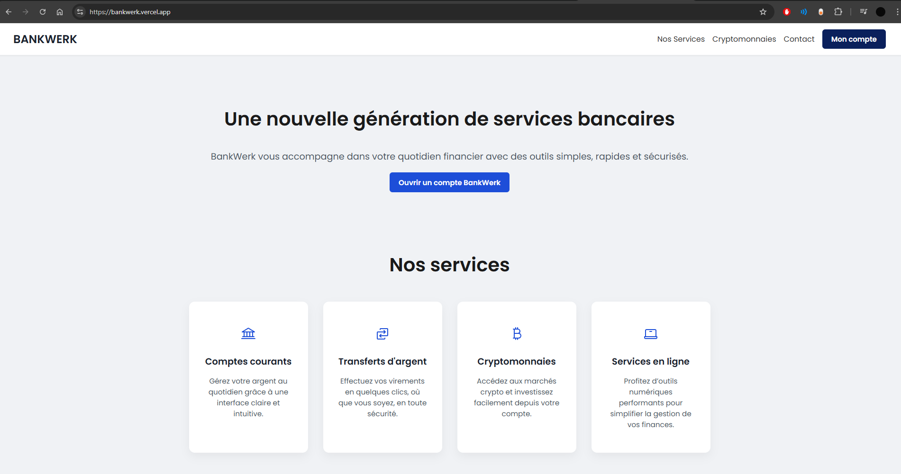

       

## Bankwerk

Objectif : Réaliser une plateforme bancaire

- Créer un compte (/register)
- Se connecter (/login)
- Voir son solde (/dashboard)
- Voir les cours de Cryptomonnaie (/cryptos)
- Réaliser des virements entre deux comptes (/transfer)
- Réaliser des opérations de ventes/achats (/buy ou /transfer)

## Lien(s)

- [Bankwerk.com](https://bankwerk.vercel.app/)
- [Github](https://github.com/MathieuAudibert/Reactjs-B3)
