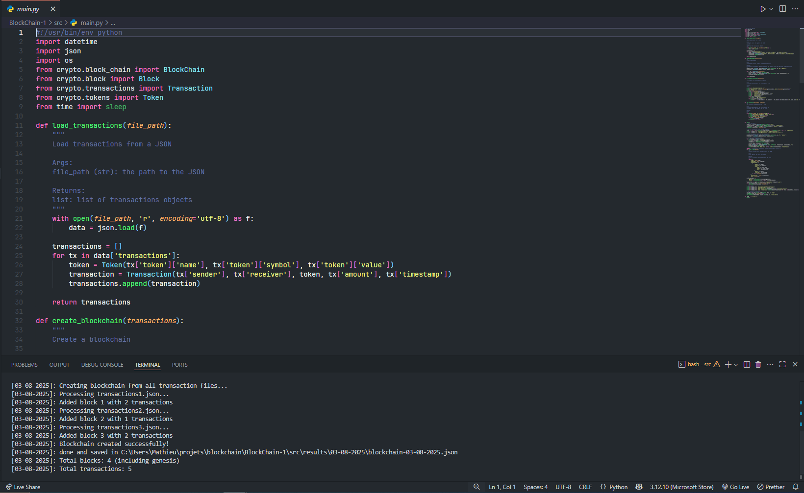

    

## BlockChain

Understanding basic cryptographics through this Python project.

I learned how to :

- Create my own token (Tekra)
- Create blocks of this token (or transactions with any other tokens/currency)
- Create block-chains for these blocks
- Create result files and logs dated
- Setup properly Sonarqube, Python & Pytest/Tox

## Lien(s)

- [Github](https://github.com/MathieuAudibert/BlockChain)
- [Image Docker](https://hub.docker.com/repository/docker/cap92/blockchainspython)
