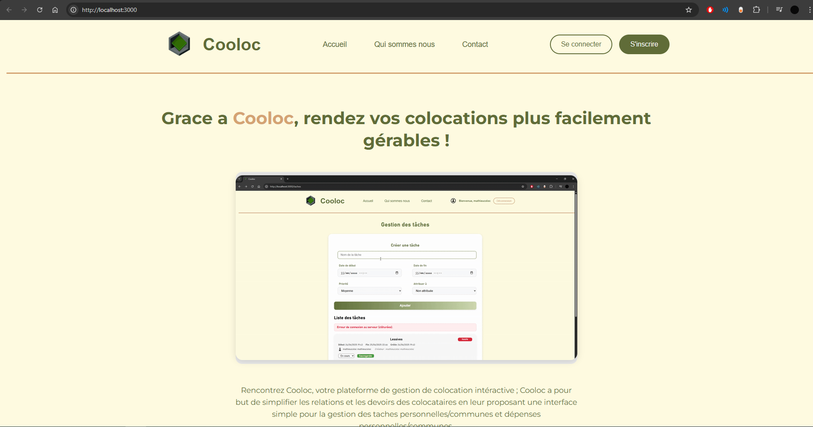

     

## Cooloc

Cooloc est un site développé pour l'obtention du titre RNCP Concepteur developpeur (CDA). Cooloc a pour but de simplifier la gestion d'une colocation

Toute la documentation du projet est dans le dossier /backups. J'ai tout mis en OpenSource parceque c'est ca l'interet du développement : le partage 🤝

## Lien(s)

- [Github](https://github.com/MathieuAudibert/Cooloc)
- [Présentation](https://docs.google.com/presentation/d/1Y5bW8WoPRExJGA21GxMHyY46XTlmjm0y1gQCe2c5fsE/edit?usp=sharing)
- [Rapport](https://docs.google.com/document/d/1N-IaB4XX8bFHh0D9jEAmT1BzQz1PJqrzT2tkXwD2LsI/edit?usp=sharing)
