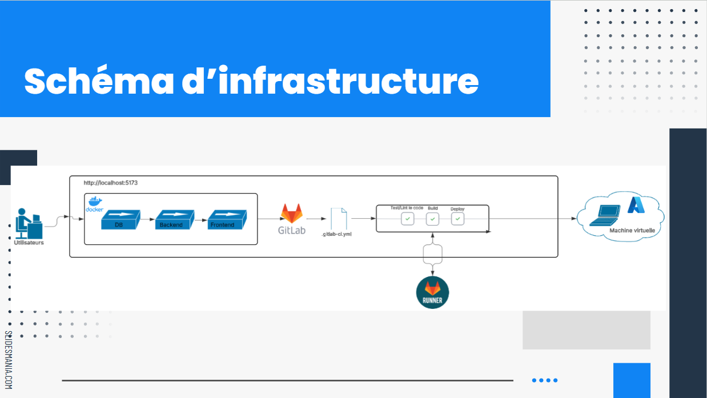

        

## DevOps

Ce projet nous a permis de mettre en pratique les fondamentaux de la culture DevOps : automatisation, collaboration et déploiement continu. Même si l’application est simple, l’essentiel de notre travail s’est concentré sur l’infrastructure et la chaîne de livraison.

Nous avons utilisé :

- Docker pour isoler les services (frontend, backend, BDD),
- Ansible pour automatiser le déploiement sur VM Azure,
- GitLab CI pour gérer une pipeline complète (test, build, deploy),
- Et un usage rigoureux de Git avec des branches et merge requests.

## Lien(s)

- [Gitlab](https://gitlab.com/mathieuaudibert1/devops)
- [Rendu du projet](https://docs.google.com/document/d/1tZXKpxXM3bd1ITAWqP1Z0WRz9vU0IkZRH0Nkc57SUDE/edit?usp=sharing)
- [Presentation](https://docs.google.com/presentation/d/1Fm0I1w7z8tHO1HOV-wpempNVbB0-JY0kFJ9BSgK9pU0/edit?usp=sharing)
