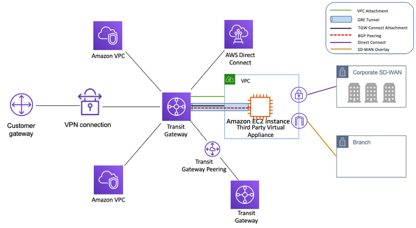

   

## TGW-Reporting

Little Open-Source python script to report [transit-gateways](https://docs.aws.amazon.com/fr_fr/vpc/latest/tgw/what-is-transit-gateway.html) of aws account(s).

- List and storage in a python script all of the TGW in a AWS acc.
- Creates output files in .json and .r format
- Strong unit testing for the account
- Assume role tuto (Security ++)
- Github actions to have a better run sort of report

## Lien(s)

- [Github](https://github.com/MathieuAudibert/TGW-Reporting)
